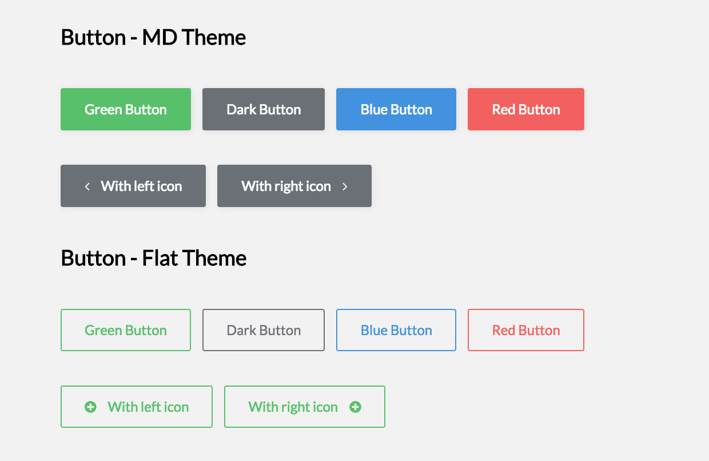
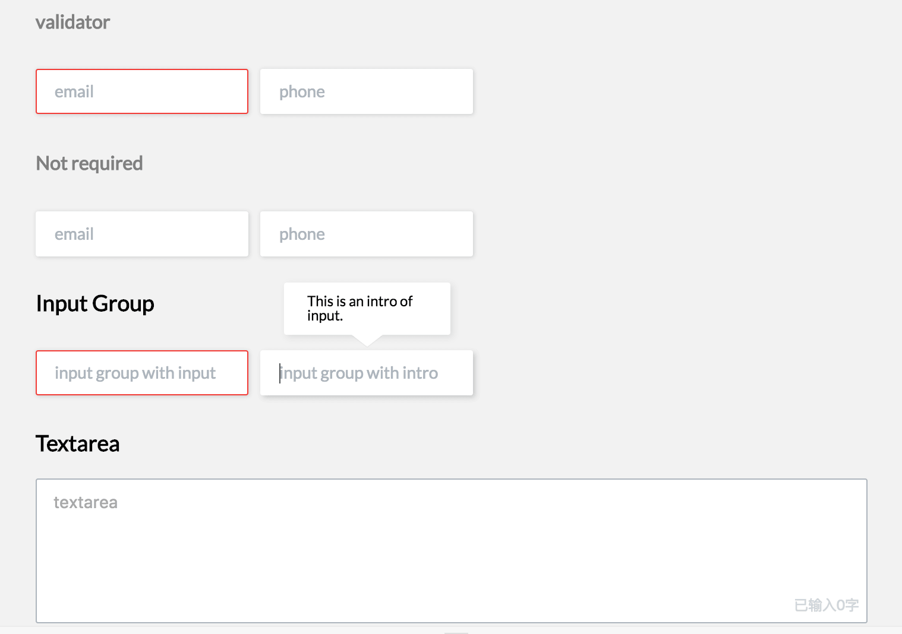
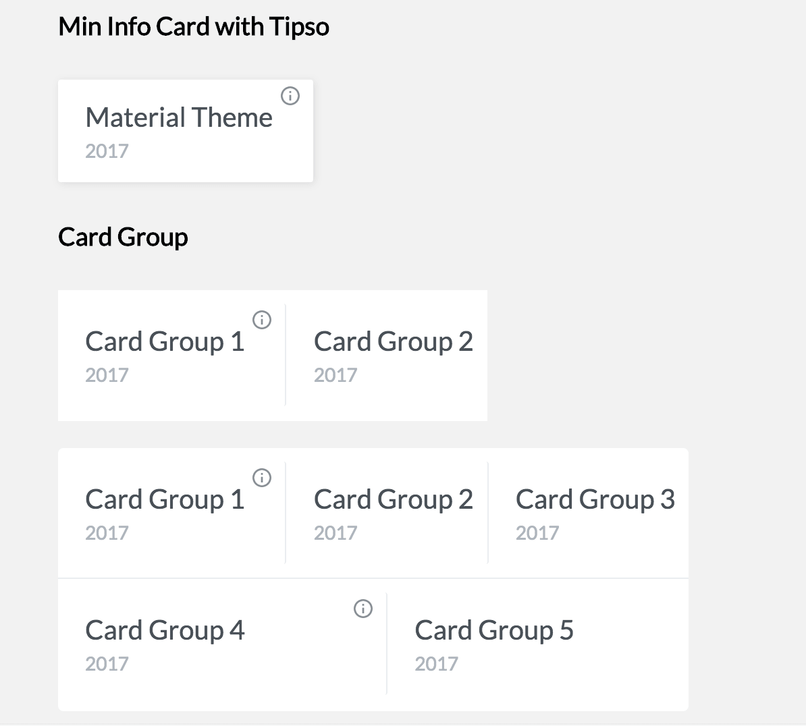
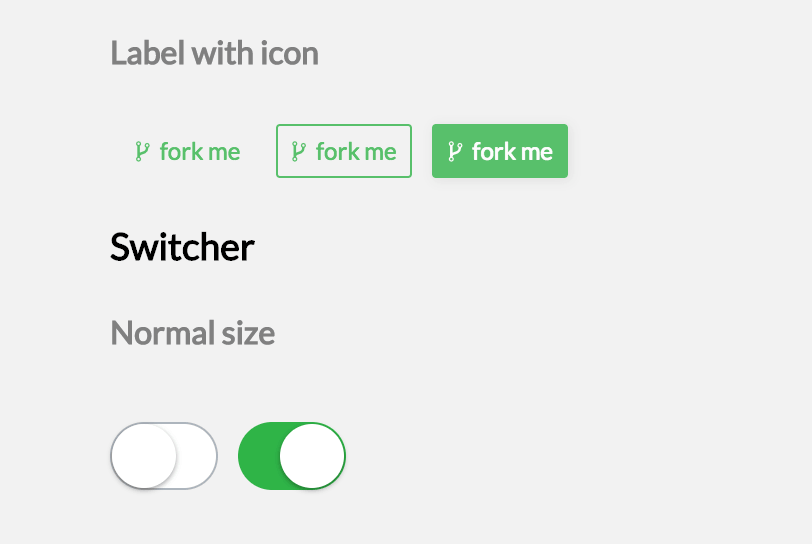

<!-- START doctoc generated TOC please keep comment here to allow auto update -->
<!-- DON'T EDIT THIS SECTION, INSTEAD RE-RUN doctoc TO UPDATE -->
**Table of Contents**  *generated with [DocToc](https://github.com/thlorenz/doctoc)*

- [Light-UI](#light-ui)
  - [Doc](#doc)
  - [Screenshots](#screenshots)
  - [Todo](#todo)
  - [License](#license)
  - [Author](#author)

<!-- END doctoc generated TOC please keep comment here to allow auto update -->

## Light-UI

    

> UI Components for [hacknical](https://github.com/ecmadao/hacknical)

### Doc

- [documents](https://github.com/ecmadao/light-ui/wiki)
- [examples](https://github.com/ecmadao/light-ui/tree/master/examples)
- [online demo](https://ecmadao.github.io/light-ui)

### Screenshots

### Todo

- [x] README
- [x] API Doc
- [ ] Raw javascript components
- [x] EsLint

### License

[MIT License](./LICENSE)

### Author

[ecmadao](https://github.com/ecmadao)